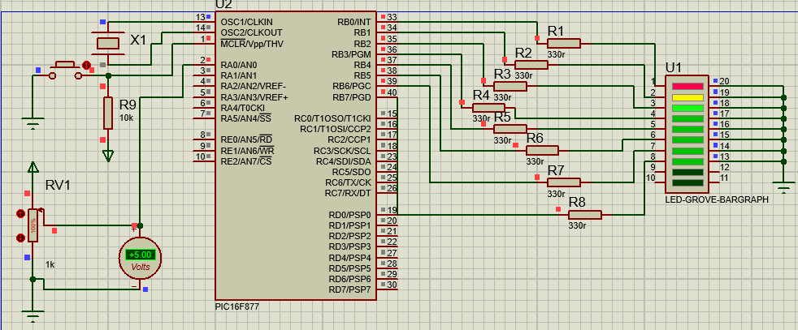

# ConversorAD
Para este projeto será utilizado um método básico de utilização de um canal do conversor analógico-digital do microcontrolador PIC16F877 e utilizando o compilador C. Neste circuito existe uma entrada de tensão variável que será convertido em um valor digital a ser apresentado pelo microcontrolador. O valor digital corresponde ao valor de tensão inserido na entrada que será mostrada através dos oitos leds. O valor será mostrado em binário que corresponde o valor de tensão aplicada a entrada analógica.

